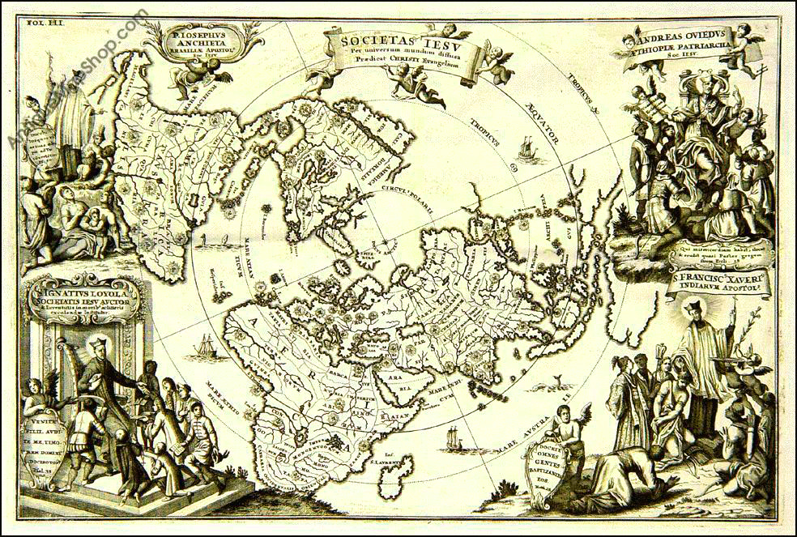
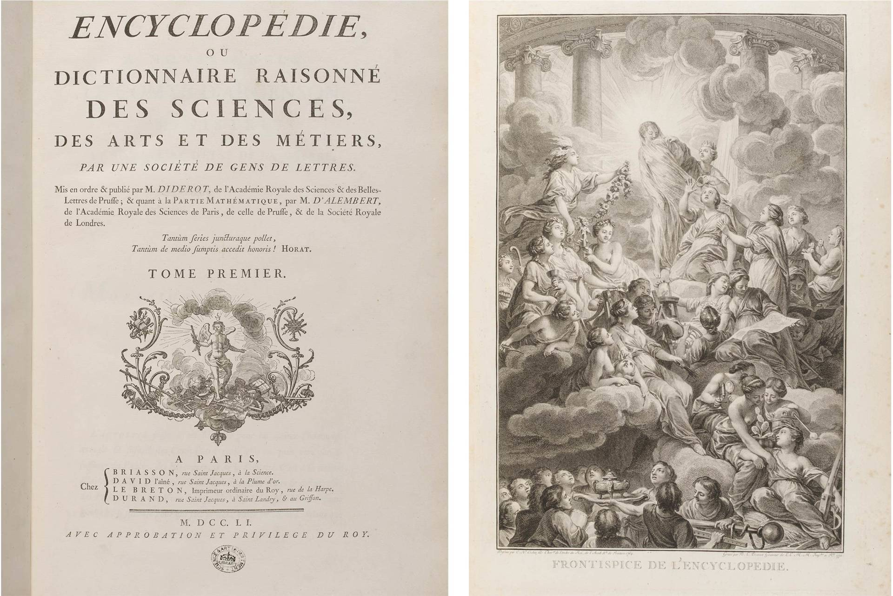
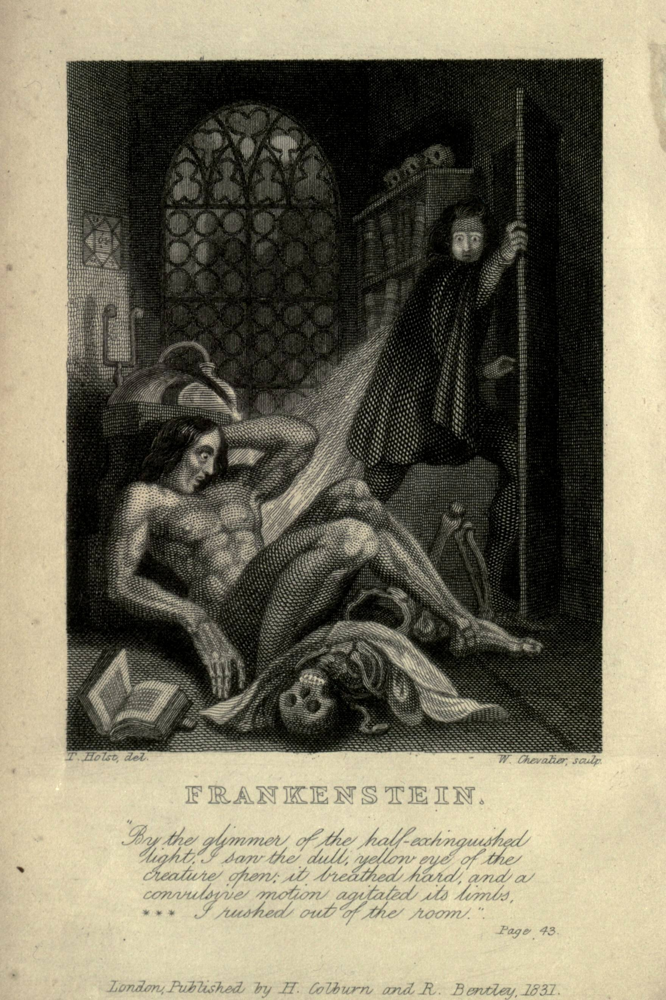
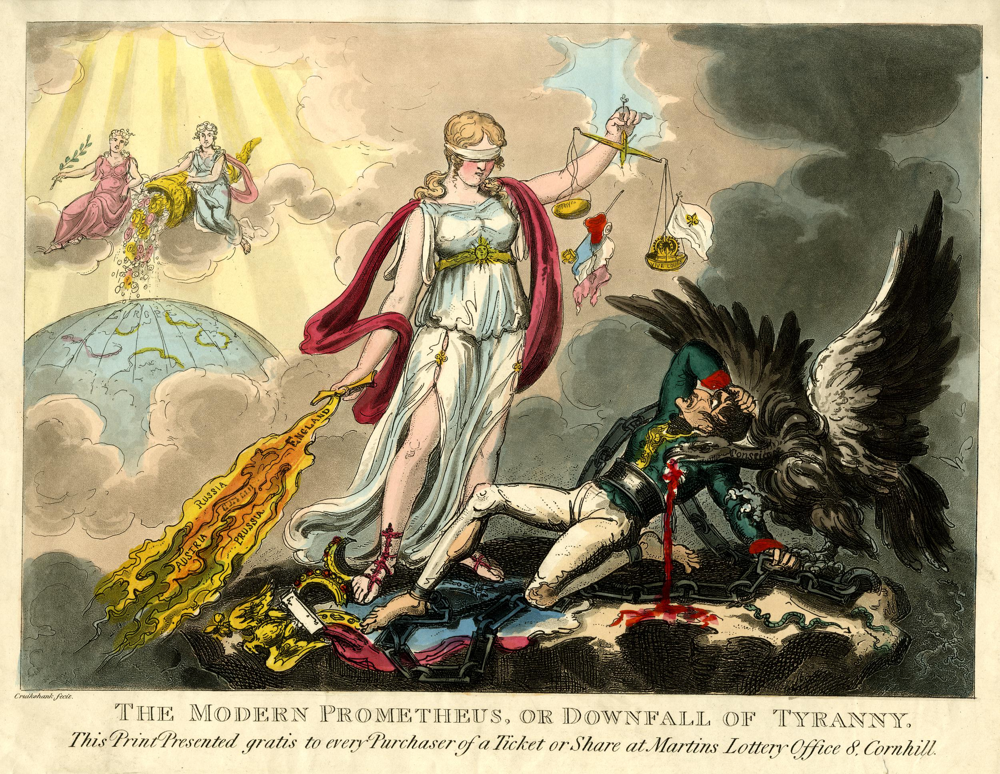

# Ciencia y religión. Hibris, Prometeo y Frankenstein

# Prometeo, Frankenstein y la tentación de saber

¿Qué tienen en común una misión jesuita, Galileo frente a sus jueces, Lutero ante una asamblea, la *Encyclopédie*, una guillotina y el monstruo de Frankenstein? A primera vista, parecen escenas pertenecientes a historias distintas. Sin embargo, juntas cuentan una de las grandes narrativas de la modernidad: la transformación de nuestras relaciones con el conocimiento, la autoridad y los límites de lo humano.

La presentación del seminario **Tecnociencia y religión: antagonismo, convergencia y reinvención** comienza precisamente proponiendo tres figuras para pensar esta historia: **hibris, Prometeo y Frankenstein**. No son simplemente referencias literarias. Funcionan como imágenes de una pregunta que sigue siendo inquietantemente contemporánea: **¿hay algo que no deberíamos conocer, crear o transformar, incluso cuando técnicamente podemos hacerlo?**

Durante mucho tiempo hemos contado la historia de ciencia y religión como una guerra. De un lado estaría la fe, asociada a la tradición y a la autoridad; del otro, la ciencia, asociada a la razón, la experimentación y la libertad. Algunas de las imágenes de la presentación evocan justamente esa narrativa: Galileo, la Reforma, la Revolución Francesa y la *Encyclopédie*. Parecerían describir una marcha progresiva desde un mundo gobernado por la religión hacia otro organizado por la razón.

Pero las imágenes también permiten contar otra historia.

El mapa jesuita que aparece al comienzo nos recuerda que conocimiento, exploración, evangelización y expansión europea estuvieron profundamente entrelazados. La religión no fue simplemente un obstáculo que la ciencia tuvo que superar. Instituciones religiosas participaron en la circulación de conocimientos, en la observación de territorios, en la educación y en la producción de determinados órdenes del mundo. De igual manera, la ruptura moderna entre ciencia y religión nunca fue tan limpia como solemos imaginar.

Incluso la Ilustración conserva algo de la antigua ambición religiosa: la esperanza de construir un conocimiento capaz de ordenar el mundo. La *Encyclopédie*, presentada visualmente en el curso, representa esa voluntad de reunir, clasificar y hacer accesible el conocimiento humano. Pero junto a ella aparece también la Revolución y la guillotina. La razón que promete emancipación puede convertirse igualmente en instrumento de poder. Conocer, clasificar y transformar nunca son actividades completamente inocentes.

Es aquí donde **Prometeo** se vuelve una figura particularmente poderosa.

En el mito, Prometeo roba el fuego a los dioses y lo entrega a los humanos. El fuego representa técnica, conocimiento y capacidad de transformación. La civilización comienza con una transgresión. La tecnología aparece entonces acompañada desde el principio por una ambivalencia: aquello que nos permite superar nuestros límites también puede producir nuevas formas de destrucción.

Mary Shelley radicaliza esta pregunta en *Frankenstein, or the Modern Prometheus*. En la presentación, la portada de *Frankenstein* aparece inmediatamente antes de una imagen titulada *The Modern Prometheus*. La asociación no podría ser más clara: Victor Frankenstein es el científico prometeico que pretende atravesar una de las fronteras fundamentales de la condición humana, la separación entre vida y muerte.

Pero el problema de Frankenstein no es simplemente que produzca una criatura artificial.

El problema es la relación que establece con su propio deseo de conocimiento.

En uno de los pasajes escogidos para cerrar esta secuencia, Victor reflexiona sobre aquello que ha perdido durante su obsesión científica. Advierte que la búsqueda del conocimiento puede volverse ilegítima cuando destruye los afectos, la tranquilidad y los vínculos que sostienen una vida humana. El conocimiento deja entonces de ser automáticamente virtuoso. La pregunta ya no es únicamente **¿podemos hacerlo?**, sino **¿qué clase de personas y qué clase de mundo producimos al hacerlo?**

Resulta significativo que la presentación termine con una oración de Santo Tomás antes del estudio. Después de Prometeo y Frankenstein, reaparece la relación entre conocimiento y virtud. La imagen propone casi un contrapunto: frente a la búsqueda ilimitada del saber, conocer puede concebirse también como una práctica que requiere prudencia, responsabilidad y una determinada disposición ética.

Esta tensión atraviesa todavía nuestra relación con la tecnociencia. Inteligencia artificial, ingeniería genética, reproducción asistida, geoingeniería o extensión de la vida vuelven a colocarnos frente al dilema prometeico. Cada nueva capacidad técnica parece ampliar el territorio de aquello que podemos hacer y, al mismo tiempo, vuelve más urgente la pregunta por aquello que **debemos** hacer.

Por eso quizá la relación entre ciencia y religión sea más interesante cuando dejamos de imaginarla únicamente como antagonismo. Ambas han intentado responder, de maneras diferentes y frecuentemente conflictivas, preguntas sobre el conocimiento, la creación, la responsabilidad y los límites humanos.

Frankenstein continúa acompañándonos porque la criatura nunca fue solamente el monstruo.

El verdadero problema era, y sigue siendo, **qué hacemos con el fuego después de haberlo robado**.
